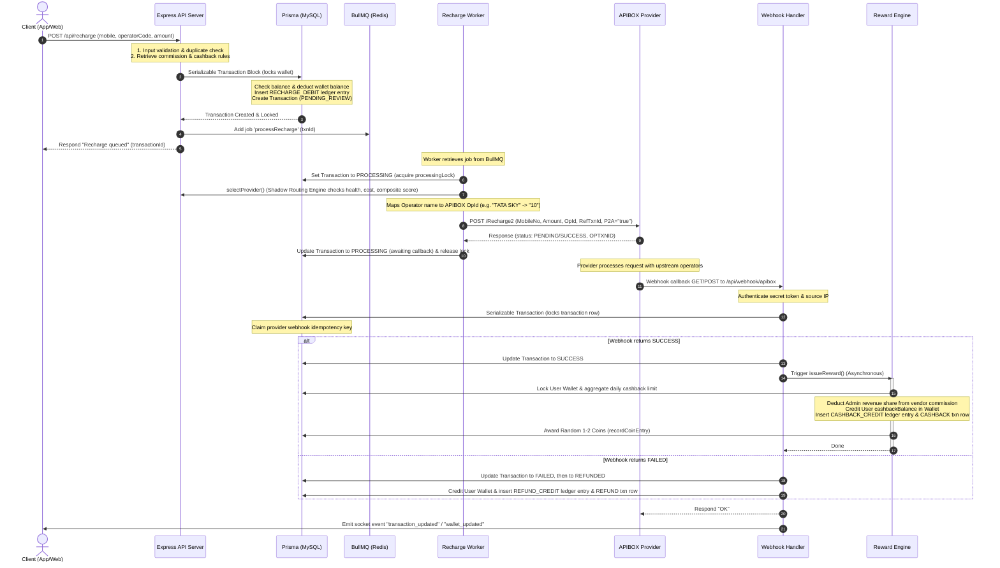

# DTH RECHARGE INTEGRATION — ARCHITECTURE AUDIT

This audit provides a comprehensive architectural analysis of the DiziPay/iRecharge ecosystem (Backend, Client User Web, Admin Panel, and Mobile Application) before integrating DTH Recharge functionality.

---

## 1. Existing Recharge Architecture Flow

The DiziPay system uses an asynchronous, queue-driven, and ledger-backed recharge pipeline. DTH recharge will reuse this robust architecture. Below is the complete trace of a recharge transaction from initiation to completion/refund.

### Transaction Processing Flow

---

## 2. Component Reusability & Impact Analysis

### Mobile Application (`recharge-mobile-app`)
* **Reusable Components**:
  * `AnimatedHeader`, `AppCard`, and `GradientButton` (from `REHARGE-APP/app/components/ui`) are highly polished, responsive, and ready for reuse.
  * `checkWalletBalance` utilities correctly handle balance verification, automatic draft creation, and redirection to the `/add-money` flow on insufficient funds.
  * `report-recharge.tsx` (Recharge Report) and `passbook.tsx` already retrieve transaction arrays and filter them. They are fully compatible with items marked as `"DTH"`.
* **Required Modifications**:
  * `dth-recharge.tsx`: Remove the `Coming Soon` alert and implement `apiClient.post('/recharge')` to submit DTH recharges.
  * `(tabs)/index.tsx` & `all-services.tsx`: Change the DTH grid tiles' routes from `/coming-soon` to `/dth-recharge` and remove the `COMING SOON` badges.

### Client User Web (`client-user`)
* **Reusable Components**:
  * `RechargePaymentModal`: Handles password checks and initiates payments via the central API wrapper.
  * `InvoiceModal`: Dynamically retrieves transaction snapshots, customer details, and operator reference IDs. It computes net adjustments and prints PDF receipts. It is fully ready for DTH (resolves to `[OPERATOR] RECHARGE`).
  * `Support/Dispute System`: Reuses `user/disputes` and references operator names, numbers, and amounts dynamically. No front-end modifications are required for disputes.
* **Required Modifications**:
  * `DTHRecharge.jsx`: Rebuild the placeholder screen into a multi-step DTH Recharge page. It should allow selecting DTH operators, entering subscriber IDs, triggering plan lookups, validating customer accounts, and initiating recharges.
  * `operators.js`: Map the MPlan API codes for DTH operators to load plans and configure logos.

### Admin Panel (`admin-web`)
* **Reusable Components**:
  * **Operator Management (`Operators.jsx`)**: Configures provider priorities, health states, and routing toggles. DTH works natively under this structure because providers are configured globally, not per-operator.
  * **Transaction History (`TransactionHistory.jsx`)**: Queries and renders transaction logs dynamically. DTH recharges will appear automatically under type `RECHARGE`.
  * **Dispute Management (`DisputeManagement.jsx`)**: Displays raised tickets and lets admins process refunds or write remarks. It is fully DTH-compatible.
* **Required Modifications**:
  * Seeding/Configuration: Seed DTH operators in the database so that routing rules, commission structures, and analytics registers load them correctly.

---

## 3. Provider (APIBOX) Capability Analysis

APIBOX is the main backend gateway and fully supports DTH transactions using the same endpoints as mobile.

| Function | Mobile Support | DTH Support | Integration Status |
| :--- | :--- | :--- | :--- |
| **Operator Codes** | Mapped (`1` to `5`) | Mapped (`6` to `10`) | Static mapping exists in `config/operators.js` |
| **Recharge API** | `/Recharge2` | `/Recharge2` | Core `apiboxService` recharge method is 100% reusable |
| **Status API** | `/StatusCheck` | `/StatusCheck` | Fully reusable. Queries status by `RefTxnId` |
| **Plans API** | Live (MPlan) | Missing | Backend plans controller must fetch from DTH-specific endpoint |
| **Validation API**| Sim HLR | Missing | APIBOX DTH Customer Info API must be integrated |

### APIBOX Mapping Specifications
* **Tata Sky**: Mapped to code `"10"` (Normalized Name: `TATA SKY`)
* **Airtel DTH**: Mapped to code `"7"` (Normalized Name: `AIRTEL DTH`)
* **Dish TV**: Mapped to code `"8"` (Normalized Name: `DISH TV`)
* **Sun Direct**: Mapped to code `"9"` (Normalized Name: `SUN DIRECT`)
* **Videocon D2H**: Mapped to code `"6"` (Normalized Name: `VIDEOCON D2H`)

---

## 4. Database Impact Analysis

The Prisma schema is fully designed to handle multi-service transactions. DTH recharge can be integrated **without database migrations, table modifications, or index changes**.

* **`operator` table**: Reused. DTH operators will be seeded as rows. The `codes` column will store metadata in JSON format: `{"code": "10", "category": "DTH", "circleRequired": false}`.
* **`transaction` table**: Reused. DTH transactions will be saved with `type: "RECHARGE"`, `operator: "[DTH_OPERATOR_NAME]"`, and the Subscriber ID in the `mobile` column.
* **`recharge` table**: Reused. Stores a 1-to-1 relationship with transactions to record failure reasons and operator codes.
* **`ledgerEntry` and `wallet` tables**: Reused. Debits and refunds execute safely within serializable transaction blocks using `FOR UPDATE` row locking.
* **`commissionRule` table**: Reused. The commission engine will resolve DTH rules automatically based on the operator's name string.
* **`dispute` table**: Reused. Disputes relate directly to transaction IDs and support failed DTH scenarios natively.

---

## 5. Security & Fallback Integrity

* **Double-Spending Prevention**: The wallet transaction block uses `SELECT * FROM wallet WHERE userId = ? FOR UPDATE` inside a serializable database transaction. This prevents concurrent balance deductions.
* **Idempotency Checks**: Backend endpoints enforce unique keys via `claimIdempotencyKey` for recharge requests (`recharge_[userId]_[mobile]_[time]`) and webhook callback execution (`webhook:[providerTxnId]:[status]`).
* **Failover Safety**: If APIBOX returns a terminal failure, the worker automatically runs `processFailureRefund` inside a serializable block to transition the status from `FAILED` to `REFUNDED` and refund the wallet balance.

---

## 6. Audit Verdict

### **VERDICT: READY FOR IMPLEMENTATION**

There are no architectural blockers. The database schema, financial ledger, security checks, queue worker, and webhook systems are fully compatible with DTH recharges. The missing components are frontend screens, database seed entries, and DTH plans/validation API integrations. These will be added as clean, modular extensions of existing patterns.
