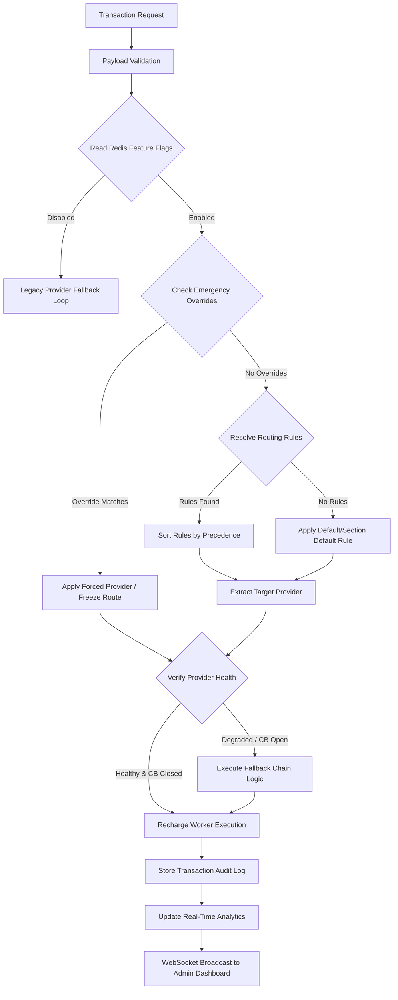
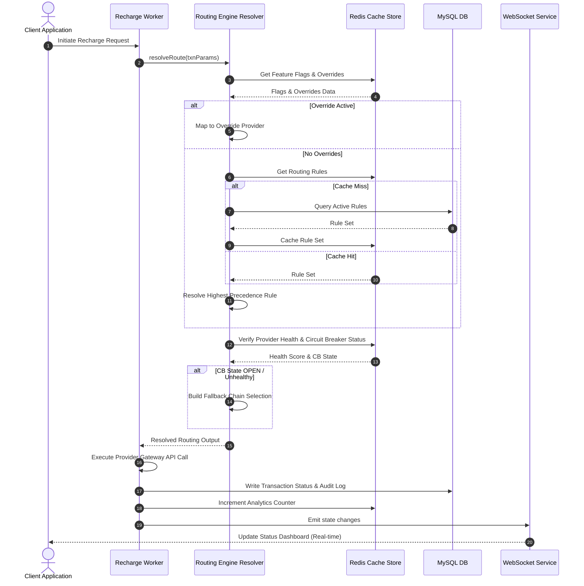
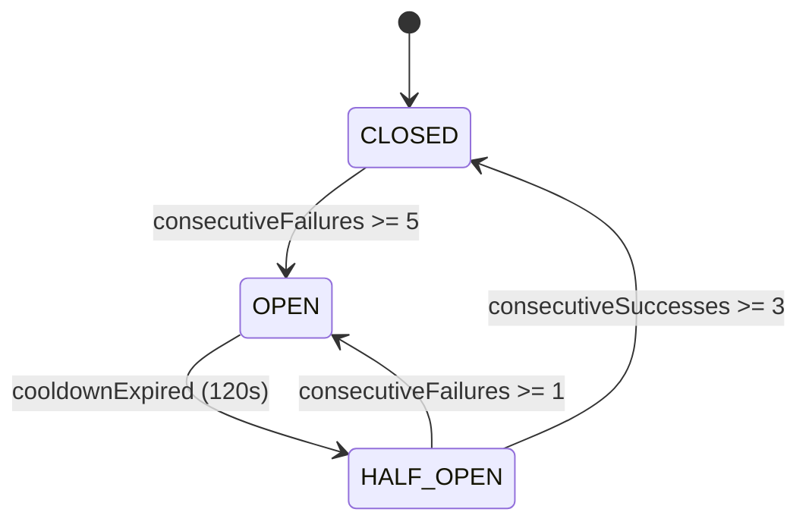

# Telecom Routing Engine - Execution & Architecture Design (Phase 0.5)

This document outlines the detailed system and integration design for the Telecom Routing Management Suite. It acts as the single source of truth for all implementations, fallback flows, cached schemas, and security controls.

---

## 1. Routing Resolution Flow

### 1.1 Mermaid Flow Diagram



### 1.2 Sequence Diagram



---

## 2. Routing Rule Precedence Matrix

### 2.1 Precedence Model
When matching a transaction request to a route, rules are evaluated sequentially in the following order:

| Precedence | Rule Type | Description |
| :---: | :--- | :--- |
| **1** | **Emergency Override** | Global bypass settings stored in Redis cache. |
| **2** | **Forced Provider Route** | Static forced provider routing config mapping. |
| **3** | **Operator + Circle Rule** | Matches both specific operator and specific region. |
| **4** | **Operator Rule** | Matches specific operator (e.g. `JIO`). |
| **5** | **Circle Rule** | Matches specific circle (e.g. `DELHI`). |
| **6** | **Amount Slab Rule** | Matches transaction amount within min/max boundaries. |
| **7** | **Section Default Rule** | Default rule designated for the target section (e.g. `DTH`). |
| **8** | **Global Default Rule** | Absolute system-level fallback rule (default: `APIBOX`). |

### 2.2 Conflict Resolution & Tie-Breaking Logic
1. **Specific vs General**: If two rules match at the same precedence level, the rule with the narrower scope is chosen. For example, an amount slab rule matching a range of $\pm$ 10 rupees takes priority over a range of $\pm$ 1000 rupees.
2. **Priority Value**: If scopes are equal, the rule with the highest `priority` integer wins.
3. **Creation Order**: If priorities are identical, the rule with the oldest `createdAt` timestamp is selected.

### 2.3 Fallback Evaluation Rules
- If the resolved provider fails health checks or is blocked by an open circuit breaker, the engine traverses the fallback chain resolved during matching.
- It selects the next provider in the chain that is healthy and has a closed circuit breaker.
- If all providers in the fallback chain are unavailable, the request defaults to the global fallback gateway.

---

## 3. Recharge Worker Integration Design

### 3.1 Worker Intake Code Modification
The BullMQ worker in `rechargeWorker.js` will invoke `resolveRoute` to determine the primary and backup providers for the transaction:
```javascript
const route = await resolveRoute({
  sectionId: txn.sectionId,
  operatorId: txn.operatorId,
  circleId: txn.circleId,
  amount: Number(txn.amount),
  serviceType: txn.type,
  simulation: false
});

const executionList = [route.selectedProvider, ...route.fallbackChain];
```

### 3.2 Exception Routing Strategies

| Exception Scenario | Recovery Action |
| :--- | :--- |
| **No Route Found** | Fallback immediately to the global default provider `APIBOX`. |
| **Provider Failure** | Move to next provider in `fallbackChain`. Log attempt in `ApiFailoverLog`. |
| **Circuit Breaker Open** | Skip provider. Log warning and route request to the secondary fallback node. |
| **Emergency Freeze** | Stop execution immediately, reject job, and mark transaction as `PENDING_REVIEW`. |
| **Redis Failure** | Safe degradation. Query MySQL directly for active rules with a local 5-second in-memory fallback cache. |
| **Database Failure** | Use local in-memory configurations (e.g., hardcoded default mappings). |

### 3.3 Traffic Rollout Matrix
Cutover will be managed live using the `trafficPercentage` Redis key:
```
Shadow Mode (Default)  --> Log comparisons, execute legacy routing.
1% Traffic            --> Route 1% of transactions through new resolver.
10% Traffic           --> Route 10% of transactions through new resolver.
50% Traffic           --> Route 50% of transactions through new resolver.
100% Traffic          --> Full production cutover.
```

---

## 4. Redis Architecture

### 4.1 Schema Specifications

| Key Pattern | Data Structure | TTL | Refresh Policy | Eviction |
| :--- | :---: | :---: | :--- | :--- |
| `routing:rules` | `HASH` | None | Write-through on rule approval. | None |
| `routing:providers` | `HASH` | None | Updated on provider CRUD settings. | None |
| `routing:health` | `HASH` | 5 Mins | Updated on health checker task completion. | volatile-lru |
| `routing:overrides` | `HASH` | None | Write-through on emergency toggle. | None |
| `routing:circuitbreaker` | `HASH` | 2 Mins | Auto-inserted when consecutive failures threshold is breached. | volatile-lru |
| `routing:featureflags` | `HASH` | None | Modified via Admin panel config. | None |
| `routing:traffic` | `STRING` | None | Updated during rollout stage transitions. | None |

### 4.2 Cache Rebuild Mechanism
On server boot or cache corruption event:
- Check database connection.
- Execute `flushall` for routing namespaces.
- Query active `ServiceSection`, `RoutingRule` (Active & Approved), and `OperatorProviderMapping`.
- Write structural JSON representations back into Redis hashes.

---

## 5. Feature Flag Strategy

We will support the following live-configurable flags inside the `routing:featureflags` Redis hash:

- `shadowRoutingEnabled`: If `true`, runs the resolver for comparisons but routes traffic using legacy order.
- `smartRoutingEnabled`: Activates smart weight scoring resolver.
- `weightedRoutingEnabled`: Enables percentage-based traffic splits.
- `healthRoutingEnabled`: Permits dynamic degradation routing based on provider response scores.
- `emergencyOverrideEnabled`: Applies global emergency freeze or forced path settings.
- `circuitBreakerEnabled`: Triages traffic away from failing providers.
- `routeSimulationEnabled`: Allows admins to test layouts.
- `trafficPercentage`: Controls the dynamic rollout stage (0 to 100).

---

## 6. Circuit Breaker Design

### 6.1 State Machine Transition



### 6.2 Parameters
- **Failure Threshold**: 5 consecutive connection timeouts or 5xx HTTP responses.
- **Cooldown duration**: 120 seconds.
- **Half-Open Probe Allocation**: 10% of matching traffic is routed to evaluate provider recovery.
- **Recovery Threshold**: 3 consecutive successful transactions restore the state to CLOSED.

---

## 7. Fallback Chain Logic

1. Resolve the matching rule's target provider.
2. If `smartRoutingEnabled` is active, fetch the priority list of providers.
3. Filter out providers that are:
   - Inactive.
   - Tripped by Circuit Breaker (`routing:circuitbreaker`).
   - Marked offline by Health Score (`healthScore < 40`).
4. Order the remaining providers to build the `fallbackChain`.
5. Iterate through the chain for retries:
   - **Timeout Limit**: 15 seconds per call.
   - **Max Retries**: Up to 3 fallback providers.

---

## 8. Provider Health Scoring

### 8.1 Metrics Formulas
1. **Success Rate ($S_{rate}$)**:
   $$S_{rate} = \frac{\text{Success Transactions}}{\text{Total Transactions in recent window}} \times 100$$
2. **Latency Score ($S_{latency}$)**:
   $$S_{latency} = \max\left(0, 100 - \frac{\text{Avg Latency (ms)}}{20}\right)$$
3. **Health Score ($HS$)**:
   $$HS = (S_{rate} \times 0.6) + (S_{latency} \times 0.4) - (\text{Consecutive Failures} \times 10)$$

### 8.2 Examples
- **Provider A**: Success Rate 98%, Avg Latency 100ms, 0 failures.
  - Latency Score = $100 - 5 = 95$.
  - Health Score = $(98 \times 0.6) + (95 \times 0.4) = 58.8 + 38 = 96.8$ (Healthy).
- **Provider B**: Success Rate 70%, Avg Latency 800ms, 2 failures.
  - Latency Score = $100 - 40 = 60$.
  - Health Score = $(70 \times 0.6) + (60 \times 0.4) - 20 = 42 + 24 - 20 = 46$ (Degraded).

---

## 9. Route Simulator Architecture

The simulator will use the production `resolveRoute` function with the `simulation` flag set to `true`:
- It disables write operations to database audit tables and prevents triggering the BullMQ queue runner.
- It returns the matches, health checks, active overrides, and a detailed reasoning trail:
```json
{
  "selectedProvider": "Plans Engine",
  "routingMode": "SMART",
  "matchedRules": [
    { "name": "Default JIO Delhi Rule", "precedence": 3 }
  ],
  "fallbackChain": ["Primary Gateway"],
  "healthScore": 96.8,
  "reason": "Smart Route resolved. Provider 'Plans Engine' selected with score 96.8.",
  "simulation": true
}
```

---

## 10. Routing Engine Contract

### 10.1 Request Payload
```typescript
interface ResolveRouteRequest {
  sectionId?: number;
  operatorId?: number;
  circleId?: number;
  amount: number;
  serviceType: string;
  simulation: boolean;
}
```

### 10.2 Response Payload
```typescript
interface ResolveRouteResponse {
  selectedProvider: string; // Aliased name
  routingMode: string;       // MANUAL, PRIORITY, WEIGHTED, HEALTH_BASED, SMART
  matchedRules: Array<{ id: number; name: string; priority: number }>;
  fallbackChain: Array<string>;
  healthScore: number;
  reason: string;
  simulation: boolean;
}
```

---

## 11. WebSocket Event Contracts

### 11.1 Trigger Event list

#### Provider Down Alert (`provider_down`):
```json
{
  "event": "provider_down",
  "payload": {
    "providerAlias": "Primary Gateway",
    "healthScore": 25.0,
    "timestamp": "2026-06-01T04:20:00.000Z"
  }
}
```
- **Consumer Pages**: Control Center, Emergency Control Board.

#### Circuit Breaker Open Alert (`circuit_breaker_open`):
```json
{
  "event": "circuit_breaker_open",
  "payload": {
    "providerAlias": "Operator Engine",
    "cooldownSeconds": 120,
    "timestamp": "2026-06-01T04:21:00.000Z"
  }
}
```

---

## 12. Analytics Architecture

- **Real-Time Layer**: Logs metrics inside Redis sorted sets (`ZADD` keys by timestamp) and hashes to enable instant dashboard queries.
- **Historical Layer**: A background worker flushes aggregated logs from Redis to MySQL database tables (`ProviderHealthMetrics`, `RoutingTrafficCounter`) every 10 minutes.
- **Retention**: Real-time Redis logs are retained for 24 hours. MySQL historical telemetry aggregates are retained for 90 days.

---

## 13. Performance Benchmarks

All benchmark assertions must satisfy the following target latency constraints:

| Operation | Target Latency | Validation Method |
| :--- | :---: | :--- |
| **Route Resolution** | $< 10\text{ ms}$ | Performance test simulation script logs |
| **Redis Lookup** | $< 2\text{ ms}$ | `redis-cli --latency` diagnostics |
| **Cache Rebuild** | $< 5\text{ s}$ | Admin control rebuild trigger check |
| **Failover Resolution**| $< 100\text{ ms}$| Execution test suite mocks |
| **WebSocket Broadcast**| $< 1\text{ s}$ | Front-to-back latency monitor |

---

## 14. Load Testing Strategy

The load testing suite will execute tests across four stages:
1. **Base Baseline (10 TPS - 100 TPS)**: Assert response times stay within target limits.
2. **Production Load (500 TPS)**: Monitor Redis connection saturation and check for database connection pool exhaustion.
3. **Stress Limit (1000 TPS - 5000 TPS)**: Verify that the queue worker handles processing spikes.
4. **Provider Storm Test**: Force failures on 2 of the 3 providers at 500 TPS to verify that circuit breakers trip and the engine safely redirects traffic.

---

## 15. Disaster Recovery Plan

- **Redis Cache Corruption**: Rebuild the cache using the `/api/admin/enterprise/cache/rebuild` endpoint, which pulls configs directly from MySQL.
- **Database Offline**: Run the routing engine on the live Redis cache. If both DB and Redis are offline, fallback to a hardcoded local provider configuration file.
- **Worker Hang**: If a job hangs, the worker task will timeout. The transaction will failover to the secondary gateway and the failed job will be moved to the Dead Letter Queue (`recharge_dlq`).

---

## 16. Production Cutover Plan

```
[STAGE 1: Code Deployment]
  - Deploy server routes, controller actions, and UI screens. Set all feature flags to false.
[STAGE 2: Enable Shadow Mode]
  - Set shadowRoutingEnabled to true. Check RoutingDecisionLog to compare resolver vs actual execution.
[STAGE 3: 1% Rollout]
  - Set trafficPercentage to 1. Verify routing success rates.
[STAGE 4: 10% Rollout]
  - Set trafficPercentage to 10. Check metrics under active load.
[STAGE 5: 100% Rollout]
  - Full cutover. Disable shadow mode.
```
*Note: Any failure triggers a rollback to the previous stage by setting the rollout parameters in Redis.*
