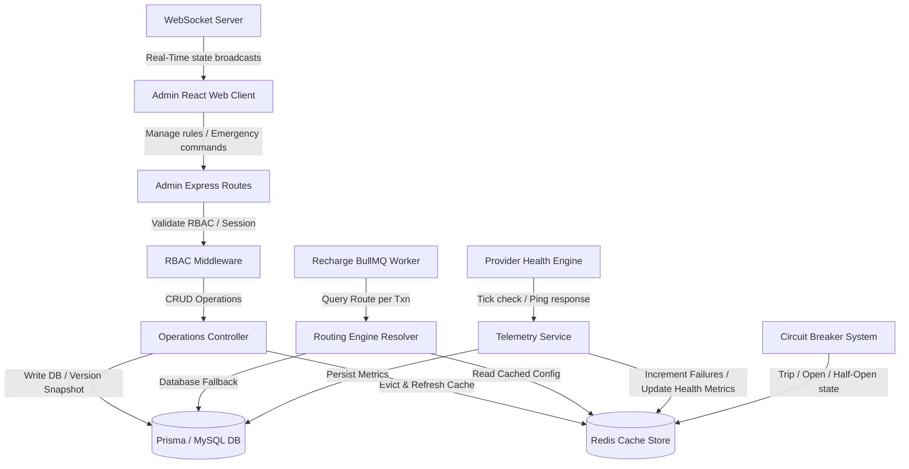

# DiziPay Telecom Routing Management Suite - Implementation & Migration Report

This report outlines the technical blueprint, database architecture, engine routing algorithms, caching strategies, and risk mitigations for the Telecom Routing Management Suite.

---

## 1. Codebase Dependency Map & Graph

Below is the dependency map representing how the React frontend, admin routes, cache layer, core routing resolver, and execution worker interact.



---

## 2. Implementation Report (Phase-by-Phase Blueprint)

### Phase 1: Database Architecture
We will introduce 5 new tables and 1 extended relation structure in `schema.prisma`. 
All existing columns are preserved as optional to prevent any code regression in active modules.
- **ServiceSection**: Standard categorizations (`RECHARGE`, `DTH`, `BBPS`).
- **OperatorProviderMapping**: Specific codes mappings mapped per provider-operator relationship.
- **ProviderHealthMetrics**: Uptime, failure, timeout counters and scores.
- **RoutingRuleVersion**: Draft configurations and maker-checker audit snapshots.
- **RoutingTrafficCounter**: Real-time traffic weights routing splits counters.
- **RoutingAuditLog**: Change logs tracking who updated what, old vs new values.

### Phase 2: Routing Engine Upgrade
The routing engine (`routingEngine.js`) will resolve routes using 5 core modes:
1. **MANUAL**: Returns the single defined provider directly.
2. **PRIORITY**: Iterates active providers, sorting by lowest priority number.
3. **WEIGHTED**: Calculates probability distribution based on the configured traffic split percentages. Uses `RoutingTrafficCounter` to self-balance distribution.
4. **HEALTH_BASED**: Drops offline or degraded providers, selecting the healthiest active provider using real-time health metrics.
5. **SMART**: Dynamically scores providers using weight modifiers:
   $$\text{Score} = (W_{priority} \times S_{priority}) + (W_{health} \times S_{health}) + (W_{latency} \times S_{latency}) + (W_{cost} \times S_{cost})$$

### Phase 3: Provider Health Engine
- A background scheduler runs every 60 seconds (using a dedicated task or scheduler job).
- Checks provider latency, pings endpoints, and evaluates the recent 100 transactions' success/failure rates.
- Updates health score: 100 (excellent) down to 0 (offline).

### Phase 4: Circuit Breaker System
- Monitors consecutive failure spikes in Redis.
- State Machine:
  - **CLOSED**: Traffic flows normally.
  - **OPEN**: failureCount exceeds threshold $\to$ trips breaker for a configured cooldown window (e.g. 120 seconds). Traffic bypasses this provider.
  - **HALF_OPEN**: Cooldown expires $\to$ routes a small percentage of test traffic (e.g. 1 in 10 requests). Success restores status to **CLOSED**, failure trips back to **OPEN**.

### Phase 5: Redis Routing Cache
- Stores active routing rules, mappings, and overrides in Redis.
- Cache invalidation is triggered on every administrative update via a database hook or controller event.
- Includes a direct `/api/admin/enterprise/cache/rebuild` endpoint to force cache sync.

### Phase 6: Maker-Checker Approval Workflow
- Rules are created as a `DRAFT` or `PENDING_APPROVAL` status.
- Only a `SUPER_ADMIN` can execute the approve action.
- Approvals store a snapshot in `RoutingRuleVersion`, updates `RoutingRule` status to `ACTIVE`, and triggers a Redis cache update.

### Phase 7: Emergency Routing Control
- Immediate global overrides stored in Redis:
  - Global Routing Freeze (halts all routing decisions or falls back to a primary provider).
  - Forced Provider Route (forces specific operators/circles through a specific gateway).
  - Emergency disable of operators or circles.

### Phase 8: Route Simulator
- Provides a sandbox UI.
- Admins input operator, circle, amount, and mode.
- Evaluates rules, health metrics, and active emergency states to produce a step-by-step resolution trail *without* persisting database transaction modifications or executing API calls.

### Phase 9: Analytics Dashboard
- Charts displaying Uptime trends, Latency spikes, and Traffic split distributions.
- Built using Recharts, with support for filtering by dates, providers, circles, and operators.

### Phase 10: Audit System
- Comprehensive logs tracking rule status modifications, priority weights, and overrides.
- Searchable log interface showing old vs new JSON snapshots.

### Phase 11: Real-Time Monitoring
- Socket.io hooks trigger immediate broadcast alerts to connected admin dashboard sockets whenever a provider trips open, latencies spike, or a rule is approved.

### Phase 12-14: Admin UI, RBAC & Security
- Add an **Operations** collapsible menu.
- Enforce granular roles: `SUPER_ADMIN` (full control), `ROUTING_ADMIN` (rules management), `OPERATIONS_MANAGER` (read-only simulator/monitoring), `ANALYST` (analytics), and `VIEWER` (dashboard).
- Map real provider codes to generic client names in all API data formatting steps.

---

## 3. Migration Report

### 3.1 Commands to run:
```bash
# 1. Generate schema files and run local migrations
npx prisma migrate dev --name add_routing_suite_tables

# 2. Re-generate Prisma Client
npx prisma generate
```

### 3.2 Seeding & Compatibility
A custom seed script `prisma/seedRouting.js` will automatically:
1. Parse existing data in `OperatorMapping` and insert standard mappings into `OperatorProviderMapping`.
2. Convert legacy rules in `RoutingRule` to structure-compliant, active, and approved `RoutingRule` items to guarantee zero disruption to active systems.

---

## 4. Risk Assessment & Mitigation

| Risk | Impact | Likelihood | Mitigation |
| :--- | :---: | :---: | :--- |
| **Active Worker Regression** | Critical | Low | Keep fallback `APIBOX` return code inside `selectProvider` catch blocks so database failures always fall back to the legacy provider configuration. |
| **Redis Cache Staler/Drift** | Medium | Medium | If Redis is offline or cache keys are missing, the routing engine falls back to querying the database directly with a 5-second local cache. |
| **Concurrency Locking** | High | Low | The circuit breaker and traffic counters will update atomic Redis integers (`INCR`, `HSET`) rather than performing transactional read-and-writes to prevent database locks. |
| **Information Leak** | Medium | Low | Ensure `mapProviderToAlias` is applied in all new controllers' lists and detail endpoints before formatting JSON responses. |

---

## 5. Rollback Strategy

In the event of an emergency rollout failure:
1. Revert backend code modifications by checking out the previous stable git release branch.
2. Revert Prisma schema migrations by executing:
   ```bash
   npx prisma migrate resolve --rolled-back add_routing_suite_tables
   ```
3. Restart backend servers and clear the Redis cache to ensure the system returns to its single-provider fallback state.
