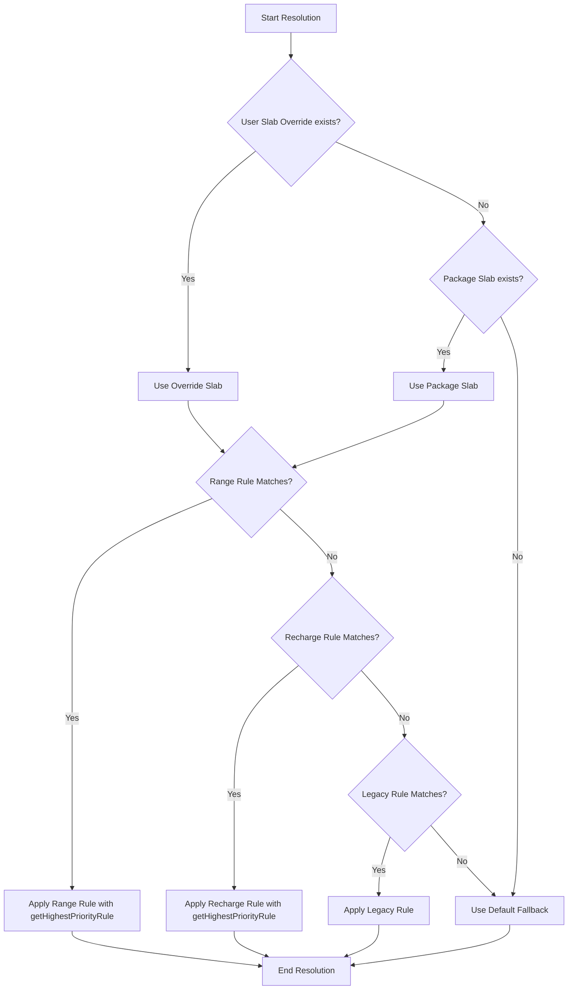

# Commission Precedence & Mode Priority Contract

This document establishes the authoritative contract for resolving telecom commissions in Dizipay.

## Mode Priority

Rules are prioritized by their `mode` in memory to guarantee deterministic behavior regardless of database enum sorting, collations, or string sorting.

| Mode | Priority Value | Description |
| :--- | :--- | :--- |
| **REAL** | 2 | Real-time commission rate overrides |
| **GENERAL** | 1 | Standard general commission rates |
| **Unknown/New Modes** (e.g., `PROMO`, `VIP`, `CUSTOM`) | 0 | Safely defaults to 0; never outranks `REAL` or `GENERAL` |

Unknown modes are assigned a priority of `0` dynamically using `MODE_PRIORITY[mode] ?? 0`.

---

## Commission Resolution Order

When resolving commissions for a transaction, the engine evaluates rules in this strict order:

1. **User Slab Override** (`user.slabId`)
2. **Range Commission Rule** (`RangeCommissionRule` within the slab)
3. **Recharge Commission Rule** (`RechargeCommissionRule` fallback within the slab)
4. **Legacy Commission Rule** (`commissionRule` table)
5. **Default Fallback Logic** (Fallback 5.0% commission)

---

## Resolution Helper

The function `getHighestPriorityRule` in [getHighestPriorityRule.js](file:///d:/Dizipay/recharge-backend/server/src/utils/getHighestPriorityRule.js) is the official single source of truth for sorting and selecting the winning rule. No direct SQL or in-line collation sorting is permitted.

### Tie-Breaker Logic
If rules have the same priority level, tie-breaking is applied in this strict order:
1. **Rule ID Descending**: Newer rules (higher auto-incremented primary key) win.
2. **Lexicographical Mode Comparison**: Alphabetical comparison on `mode` strings is used if IDs are missing or equal (e.g., for in-memory mocks/tests).
